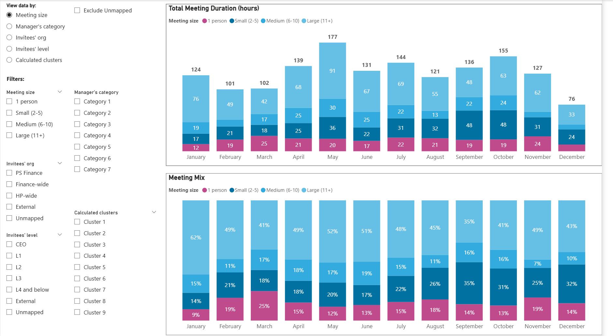
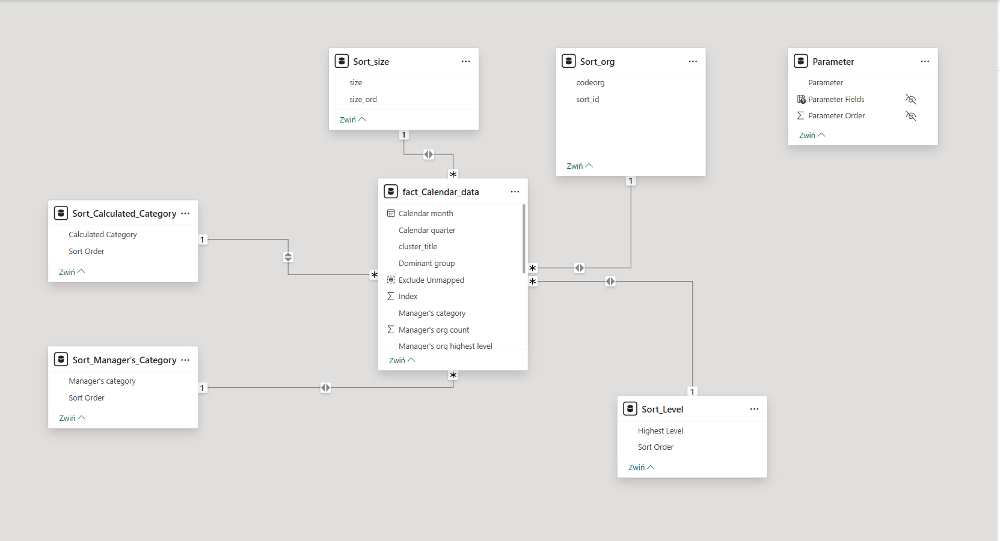
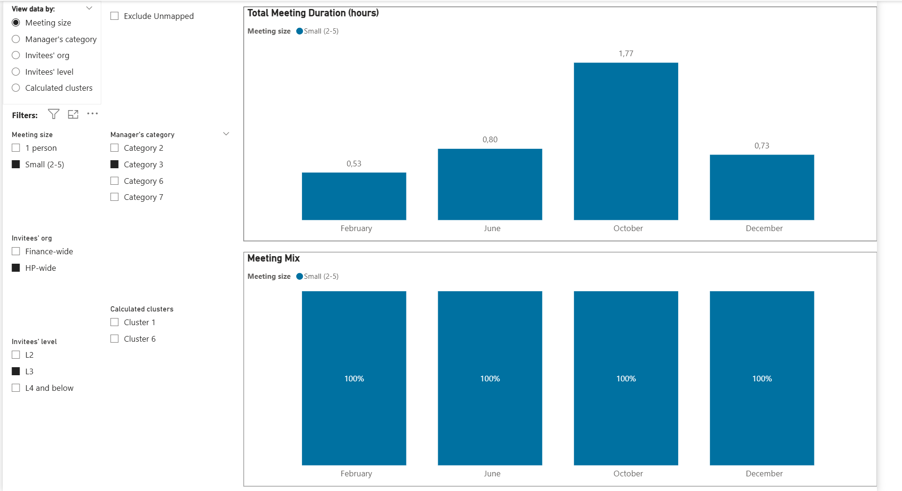

# Calendar Meeting Analytics Dashboard (PBIP Project)

This repository contains a Power BI Project (PBIP) used for analyzing
organizational meeting patterns.\
The report helps understand meeting sizes, frequency, duration,
organizational structure involvement, and behavioral clusters.

------------------------------------------------------------------------

##  Dashboard Preview
\
\


------------------------------------------------------------------------

##  Key Features

-   Monthly meeting duration trend\
-   Breakdown by meeting size (small / medium / large)\
-   Distribution of meetings across organizational levels\
-   Behavioral clusters for deeper insights\
-   Fully interactive layout and filters\
-   Clean and optimized semantic model

------------------------------------------------------------------------

##  Architecture

This PBIP project follows a standard Power BI development flow:

    Data Source
        ↓
    Semantic Model (TMDL – tables, relationships, formatting)
        ↓
    Report Layer (PBIR – pages, visuals, layout, filters)
        ↓
    End Users (Power BI Service)

------------------------------------------------------------------------

## Directory Structure

```
📦 calendar-meeting-analytics
├─ .gitignore
├─ Calendar Analysis Report.Report
│  ├─ .pbi
│  │  └─ localSettings.json
│  ├─ .platform
│  ├─ StaticResources
│  │  ├─ RegisteredResources
│  │  │  └─ Storm7280549715061715.json
│  │  └─ SharedResources
│  │     └─ BaseThemes
│  │        └─ CY24SU10.json
│  ├─ definition.pbir
│  └─ definition
│     ├─ bookmarks
│     │  ├─ 638dc7a5c0e03385b17b.bookmark.json
│     │  ├─ bookmarks.json
│     │  └─ fc1236df591ae556b149.bookmark.json
│     ├─ pages
│     │  ├─ 68d3e6d52d223cbc4d43
│     │  │  ├─ page.json
│     │  │  └─ visuals
│     │  │     ├─ 22e0e0679dae8c904800
│     │  │     │  └─ visual.json
│     │  │     ├─ 32a2c78d58160e650b0a
│     │  │     │  └─ visual.json
│     │  │     ├─ 35b2f1363b79cbcea0be
│     │  │     │  └─ visual.json
│     │  │     ├─ 651a38e58d2a8a0e4681
│     │  │     │  └─ visual.json
│     │  │     ├─ 817a537b6c20a07d1c4d
│     │  │     │  └─ visual.json
│     │  │     ├─ 981875f602d3e5482c51
│     │  │     │  └─ visual.json
│     │  │     ├─ d10143d84c63c7a8640e
│     │  │     │  └─ visual.json
│     │  │     ├─ e55860af40ce834cb92b
│     │  │     │  └─ visual.json
│     │  │     ├─ ef3b53c5097972c600ba
│     │  │     │  └─ visual.json
│     │  │     └─ facd1b2593372d86a230
│     │  │        └─ visual.json
│     │  └─ pages.json
│     ├─ report.json
│     └─ version.json
├─ Calendar Analysis Report.SemanticModel
│  ├─ .pbi
│  │  ├─ cache.abf
│  │  ├─ editorSettings.json
│  │  └─ localSettings.json
│  ├─ .platform
│  ├─ definition.pbism
│  ├─ definition
│  │  ├─ cultures
│  │  │  └─ en-US.tmdl
│  │  ├─ database.tmdl
│  │  ├─ model.tmdl
│  │  ├─ relationships.tmdl
│  │  └─ tables
│  │     ├─ DateTableTemplate_aeba4202-5ba8-4fa7-8d13-85db462683c0.tmdl
│  │     ├─ LocalDateTable_ca152873-31b0-4bd7-86eb-310a7a839b0b.tmdl
│  │     ├─ Parameter.tmdl
│  │     ├─ Sort_Calculated_Category.tmdl
│  │     ├─ Sort_Level.tmdl
│  │     ├─ Sort_Manager's_Category.tmdl
│  │     ├─ Sort_org.tmdl
│  │     ├─ Sort_size.tmdl
│  │     └─ fact_Calendar_data.tmdl
│  └─ diagramLayout.json
├─ Calendar Analysis Report.pbips
├─ README.md
└─ docs
   ├─ dashboard.png
   ├─ filters.png
   └─ model.png
```
©generated by [Project Tree Generator](https://woochanleee.github.io/project-tree-generator)

------------------------------------------------------------------------

## How to Use

### **Open the project**

1.  Clone the repo:

        git clone <repository-url>

2.  Open `Calendar Analysis Report.pbip` in Power BI Desktop.

### **Refresh the data**

-   Connect your dataset\
-   Update data source paths if required

------------------------------------------------------------------------

## Motivation

This project was created to analyze and optimize the calendar of executive manager.\
It provides visibility into:
 - how much meeting time teams spend
monthly, 
- how meeting sizes evolve, 
- which org levels participate the
most, 
- opportunities to reduce unnecessary meeting load.

------------------------------------------------------------------------

##  Tech Stack

-   Power BI Desktop\
-   JSON report definitions\
-   Star-schema modeling

------------------------------------------------------------------------

## .gitignore (recommended)

    # Power BI PBIP project
    *.abf
    *.pbi
    *.tmp
    *.cache
    .pbi/
    **/.pbi/
    **/*.lock.json
    **/Backup/
    **/Temp/

------------------------------------------------------------------------

## License

Released under the MIT License.\
You are free to use, modify, and distribute this project.

------------------------------------------------------------------------
